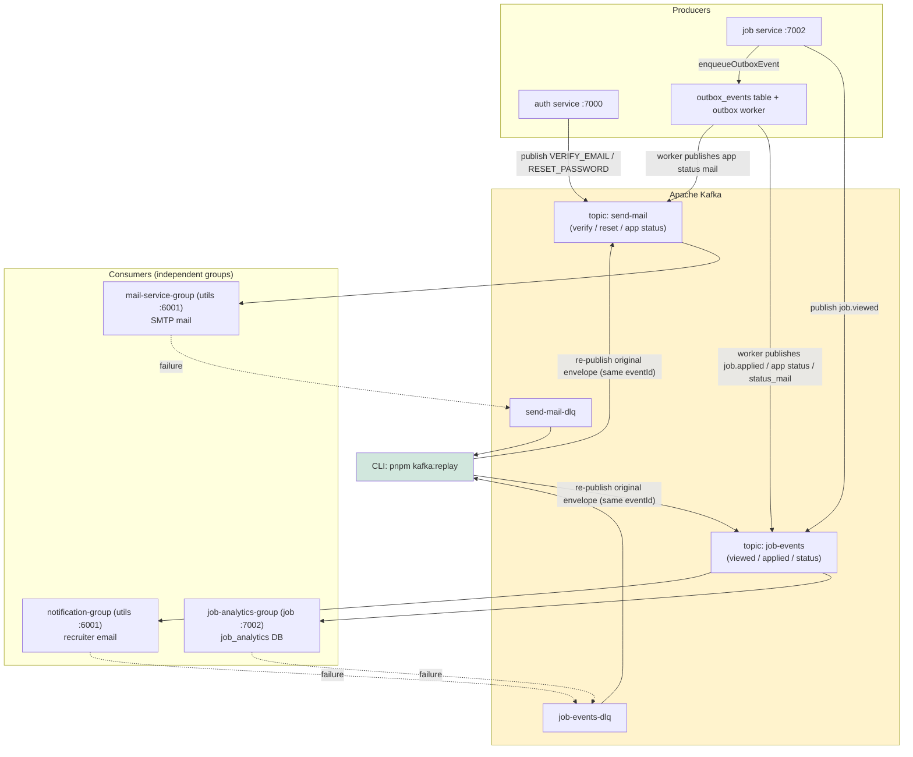

# 00 — Kafka Overview & Connection Diagram

## What Kafka does here

j-track is 4 Node services (auth, user, job, utils). Instead of one service
calling another directly for emails/analytics/notifications, they communicate
through **Apache Kafka**:

- **Auth service** → publishes "send this email" intents (email verify, password reset).
- **Job service** → publishes job events (viewed, applied, status changed) and
  some email intents (application status mail).
- **Utils service** → is the **only consumer service**: reads topics and performs
  the side effects (SMTP emails, and the job service's own analytics consumer).

Everything is wrapped in an **EventEnvelope**:

```json
{
  "eventId": "uuid",              // dedup identity — same across retries & replay
  "eventType": "job.applied",
  "eventVersion": 1,
  "occurredAt": "2026-08-13T10:00:00.000Z",
  "source": "job-service",
  "correlationId": "uuid",        // traces request -> event -> consumer logs
  "payload": { "type": "job.applied", "job_id": 42, "applicant_id": 7 }
}
```

## One global diagram



> Every consumer group receives every message on its topic: analytics and
> notification both react to the same `job.applied`, independently.

## Connection table (quick)

| From (producer) | Writes to | Via | Consumer group | Effect |
|-----------------|-----------|-----|----------------|--------|
| auth service | `send-mail` | `kafka.publish()` | `mail-service-group` | SMTP email (verify/reset) |
| job service | `job-events` | outbox worker | `job-analytics-group` | `job_analytics` DB rows |
| job service | `job-events` | outbox worker | `notification-group` | recruiter email |
| job service | `job-events` | direct `publish()` (job.viewed) | `job-analytics-group` | view counts |
| job service | `send-mail` | outbox worker (application status) | `mail-service-group` | applicant status email |
| any consumer | `send-mail-dlq` | DLQ writer | `kafka-replay` (CLI) | replay → `send-mail` |
| any consumer | `job-events-dlq` | DLQ writer | `kafka-replay` (CLI) | replay → `job-events` |

## Key rules (main points)

1. **One topic, many groups** — each group receives every message. That is how
   analytics AND notification both react to `job.applied`.
2. **At-least-once** — Kafka may redeliver. Consumers dedup by `eventId`.
3. **`eventId` never changes** across retry/DLQ/replay — so dedup stays valid.
4. **Ordering per aggregate** — message key `job-<id>` / `applicant-<id>` puts
   all events for one job in the same partition (no cross-partition ordering).
5. **In-process, no heavy infra** — metrics are plain counters logged/snapshotted
   (no Prometheus/OTel); correlationId uses Node `AsyncLocalStorage`.

Next: [`01-files-in-order.md`](01-files-in-order.md).

> Want real rendered diagrams? Jump to [`05-diagrams.md`](05-diagrams.md)
> (Mermaid — renders on GitHub, GitLab, VS Code. Preview in your editor or at
> mermaid.live for a PNG/SVG copy.)