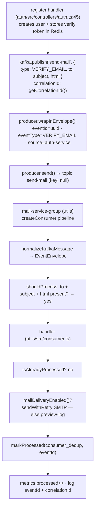
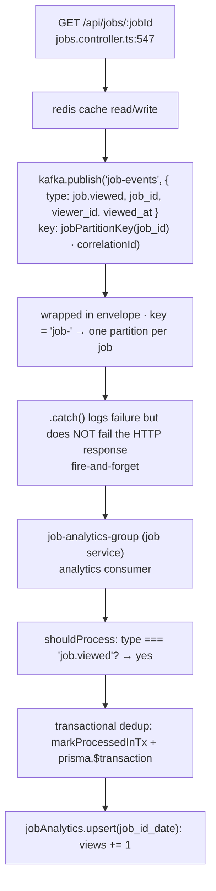
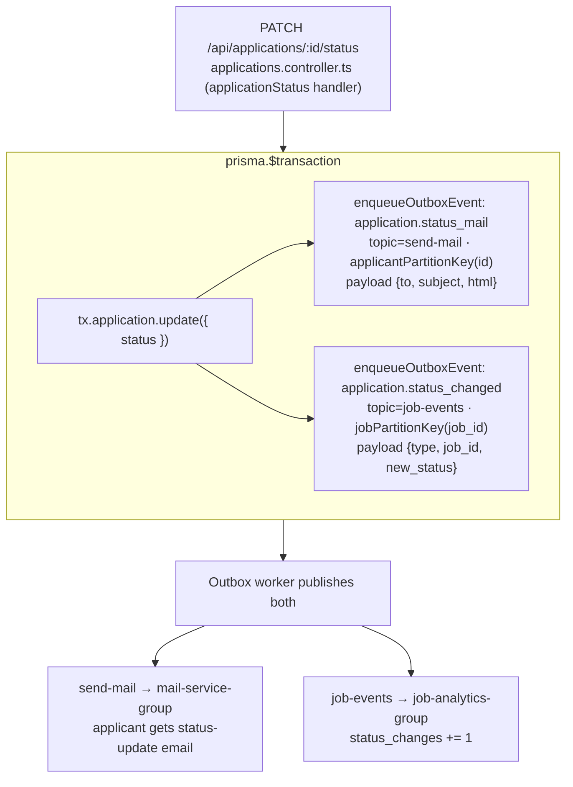
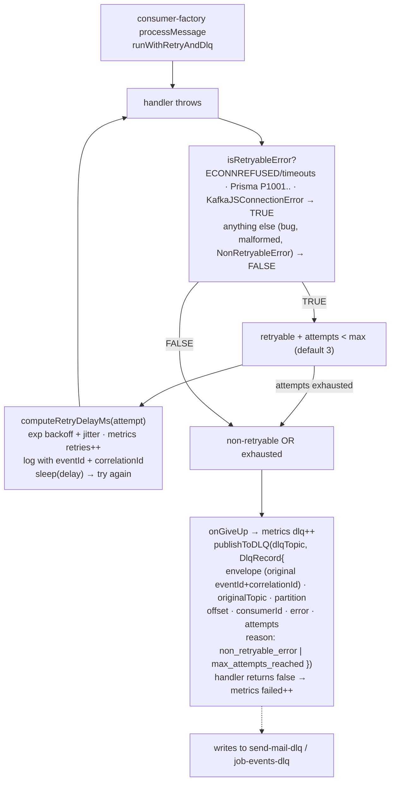
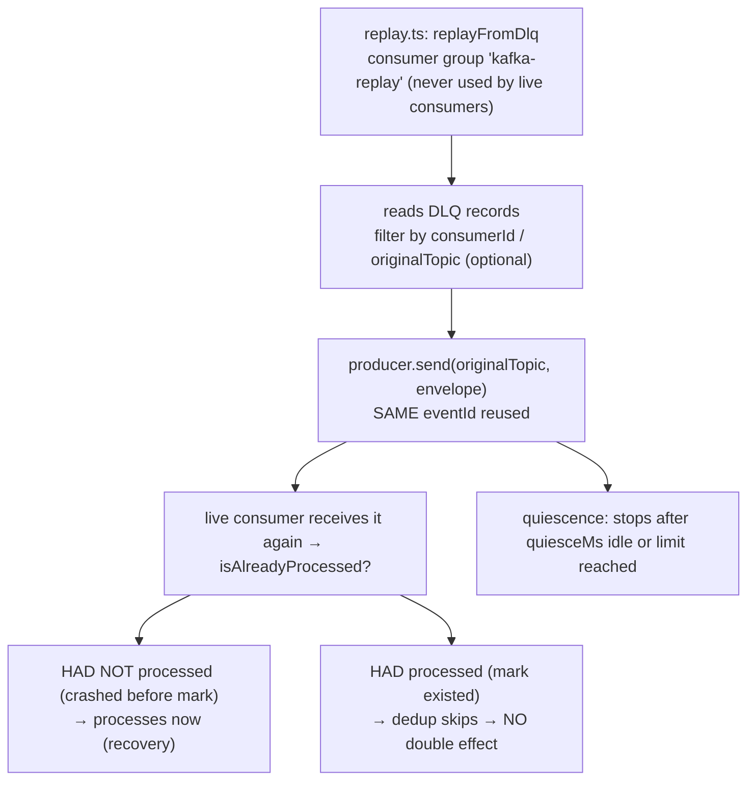
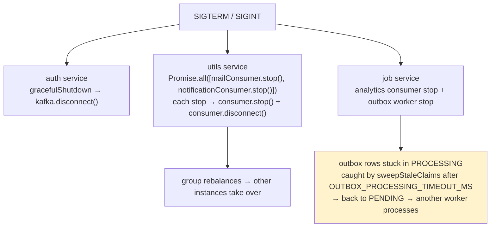

# 03 — What Happens When I Do X (every action traced through Kafka)

Each flow below assumes the services are running with Kafka reachable.

---

## Flow 1 — User registers / verifies email (auth service publishes `send-mail`)

**You do:** `POST /auth/register` (or request password reset).

**What happens:**



**Effect:** user gets "Verify Your Email" email.

---

## Flow 2 — User views a job (direct publish, fire-and-forget)

**You do:** `GET /api/jobs/:jobId` (a job detail view).

**What happens:**



**Effect:** job's view counter increments for today (no HTTP delay from Kafka).

> notification-group sees `job.viewed` too but `shouldProcess` returns false
> (only `job.applied`) → skips.

---

## Flow 3 — User applies to a job (transactional outbox + fan-out)

**You do:** `POST /api/jobs/:jobId/applications` (apply).

**What happens:**

```mermaid
flowchart TB
    APP["POST /api/jobs/:jobId/applications (apply)<br/>applications.controller.ts:69"]
    subgraph TX["prisma.$transaction — ONE commit"]
        CR["tx.application.create(...)"]
        ENQ["enqueueOutboxEvent(tx, job.applied · topic=job-events<br/>partitionKey jobPartitionKey · correlationId)"]
        CR --> ENQ
    end
    NOTE["if publish later fails, the event is NEVER lost<br/>(still PENDING in outbox_events)"]

    subgraph WORKER["Outbox worker (jobservice/src/index.ts)"]
        POLL["poll OUTBOX_POLL_INTERVAL_MS<br/>claimOutboxBatch PENDING→PROCESSING"]
        PROC["processClaimed → kafka.publish<br/>key · eventId · correlationId"]
        SENT["success → SENT"]
        RT["retryable fail → PENDING + delay"]
        FAIL["max attempts → FAILED + lastError"]
        POLL --> PROC --> SENT
        PROC --> RT
        PROC --> FAIL
    end

    subgraph EVENT["Kafka topic job-events — broadcast to BOTH groups"]
        G1["job-analytics-group (job service)<br/>job.applied → jobAnalytics.upsert applications += 1"]
        G2["notification-group (utils)<br/>shouldProcess yes → handler<br/>lookup job → recruiter → applicant<br/>sendWithRetry recruiter email · markProcessed"]
        EVENT --> G1
        EVENT --> G2
    end

    APP --> TX --> NOTE --> WORKER --> EVENT
```

**Effect:** application saved; analytics count +1; recruiter gets "New Application"
email. Both happen because of ONE publish, in separate consumer groups.

---

## Flow 4 — Job status changes (outbox + two events)

**You do:** `POST/ PATCH` application `/api/applications/:id/status` (recruiter
changes status).

**What happens:**



**Effect:** applicant email + analytics status counter, both reliable.

---

## Flow 5 — A consumer fails (retry → DLQ → replay)

**Scenario:** SMTP is down, or a message is malformed, or the DB is unreachable.



**To recover:** run the CLI

```
pnpm kafka:replay --dlq-topic send-mail-dlq --consumer-id mail-service --limit 100
```



**Effect:** failed persistent work is retried at a safe time; dedup prevents
double business effects.

---

## Flow 6 — Safe restart / graceful shutdown

**You do:** `SIGTERM` (docker stop / Ctrl+C).



- Consumers stop cleanly → group rebalances → other instances take over.
- Outbox rows in `PROCESSING` but never finished are caught by
  `sweepStaleClaims` (after `OUTBOX_PROCESSING_TIMEOUT_MS`) → back to `PENDING`
  → processed by another worker. No lost events.

---

## Flow 7 — Checking health / observability

- `GET /utils/health/ready` → consumers connected? 200 healthy / 503 degraded.
- `GET /auth/health/ready` → producer connected + broker count + topic list.
- `GET /<service>/health` → **liveness only** (process + uptime, always 200 while
  alive); readiness is the endpoint that reflects Kafka/DB health.
- Consumer logs contain `eventId` + `correlationId` on every processed/retry/DLQ
  line; metrics counters snapshot via `KafkaMetrics.snapshot()`.

Next: [`04-lifecycle-and-failures.md`](04-lifecycle-and-failures.md) for the
full pipeline detail (idempotency, retry/DLQ/replay, metrics).