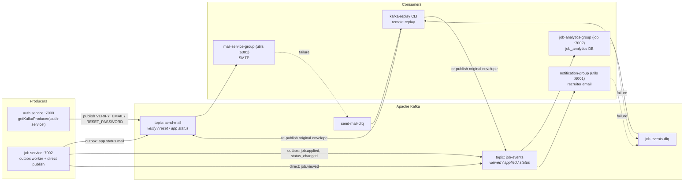
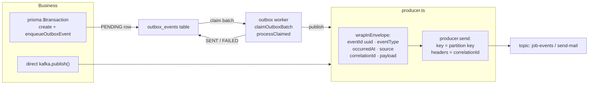
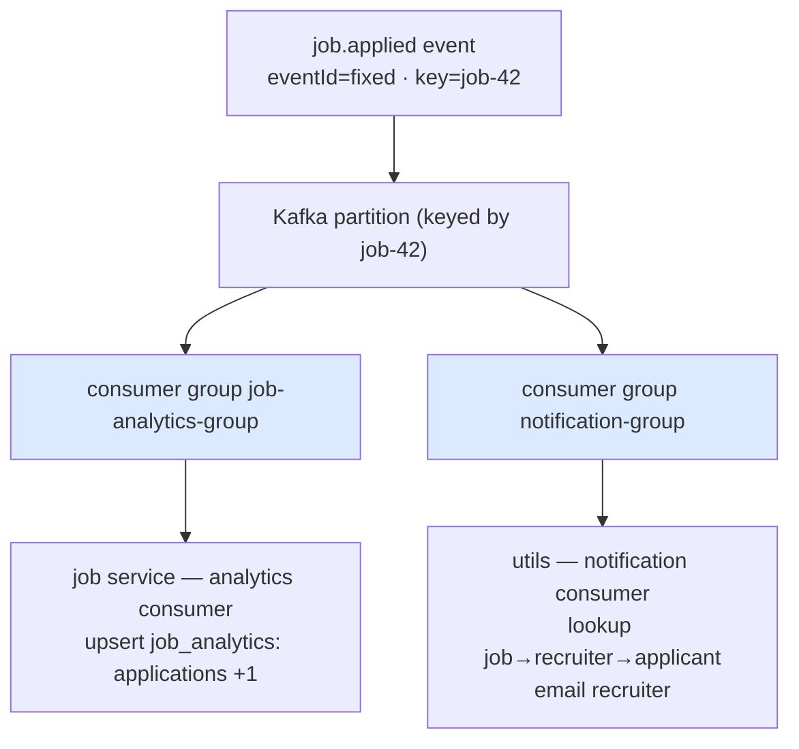
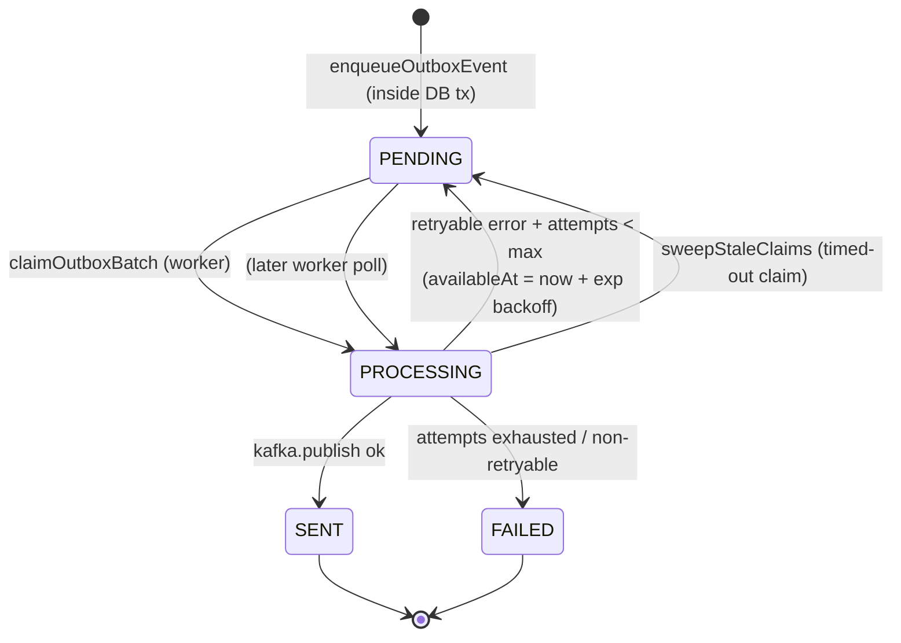
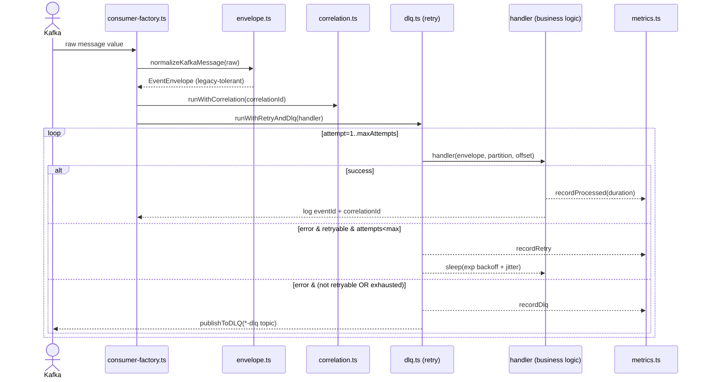
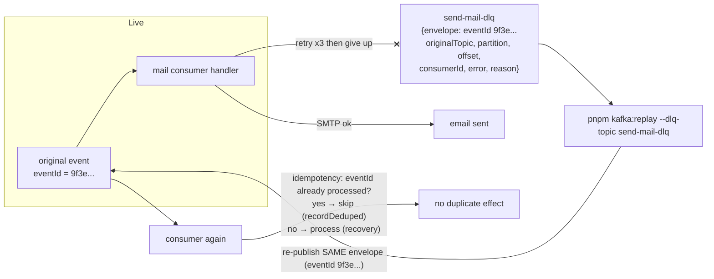
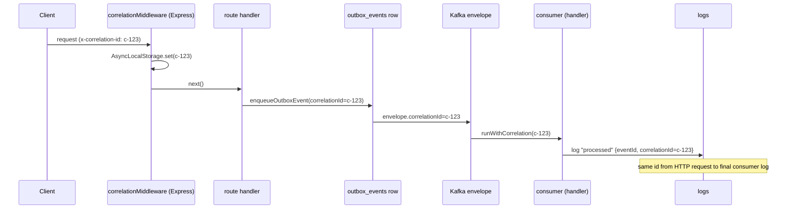
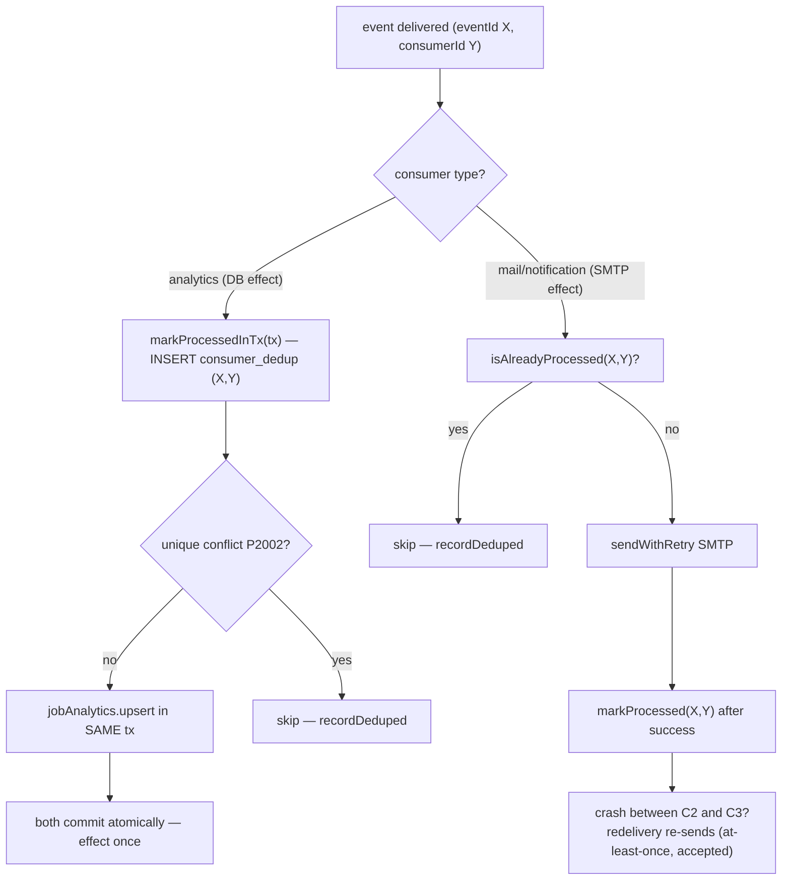
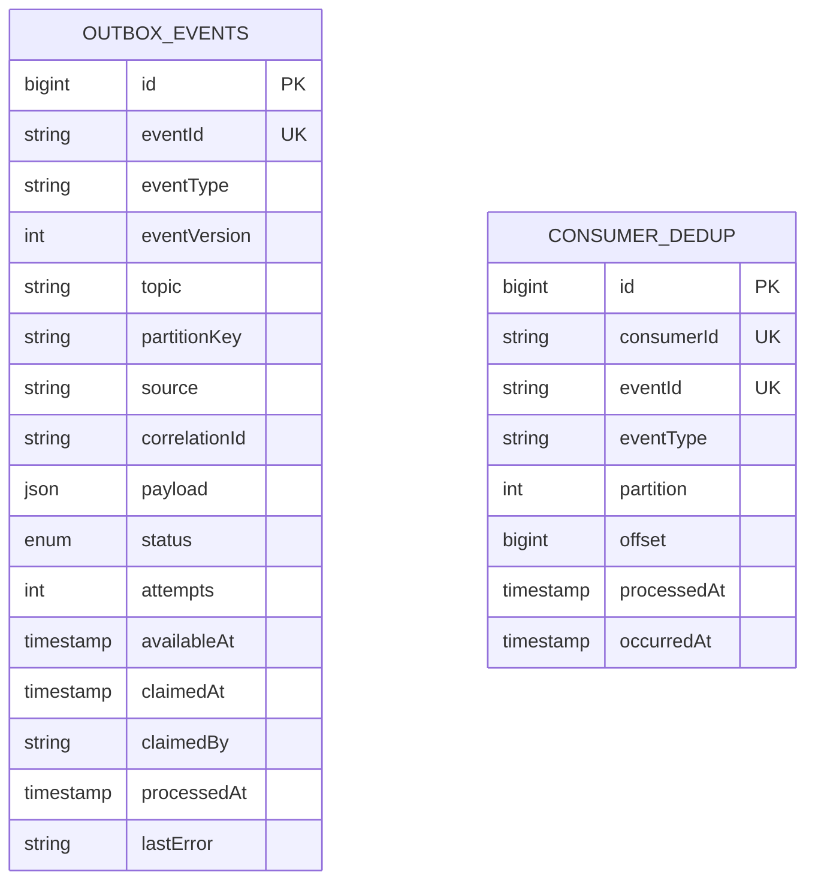

# 05 — Kafka Diagrams

> Rendered diagrams (Mermaid) + copy-paste ASCII. GitHub renders the Mermaid
> blocks directly. Source of truth for every box: the files listed in
> [`01-files-in-order.md`](01-files-in-order.md).

---

## Diagram 1 — System overview (services → Kafka → consumers)



---

## Diagram 2 — Producer internals (how a message is built & sent)



---

## Diagram 3 — Fan-out: ONE event, MULTIPLE groups



**Rule:** each *group* gets every message. Within one group, partitions are
divided among its members — add an instance and it takes over partitions
(round-robin). One group never processes the same message twice.

---

## Diagram 4 — Outbox worker state machine



---

## Diagram 5 — Consumer pipeline (every consumer runs this)



---

## Diagram 6 — Failure → DLQ → Replay → Safe reprocessing



---

## Diagram 7 — Correlation ID end-to-end



---

## Diagram 8 — Idempotency strategies (two flavors)



---

## Diagram 9 — Data model (new tables)



`CONSUMER_DEDUP` unique index: `(consumerId, eventId)` — the dedup guarantee.

---

## ASCII fallback (no Mermaid renderer)

```
 AUTH ──► send-mail ──► mail-service-group ──► SMTP ──────────► ┬─► send-mail-dlq
 JOB  ──► job-events ──┬──► job-analytics-group ──► job_analytics DB
   (outbox + direct)   └──► notification-group ──► recruiter email ─► job-events-dlq
                                                            │
                        pnpm kafka:replay ◄── DLQ topics ─────┘
```

Back to [`README.md`](README.md).